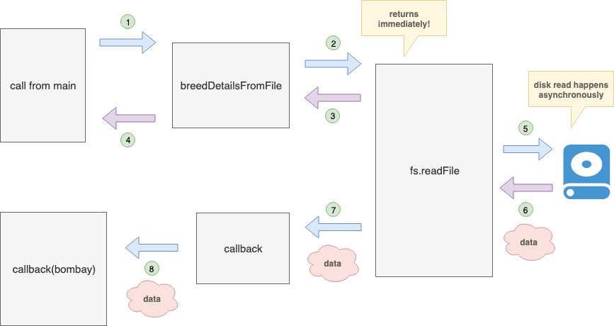

# Week 2 Learning Outcomes
## Testing Code 

## Mocha and Chai
___
- **Mocha** - gives us the *describe* and *it* functions (each it is a test and each test should have at least one assertion)
- **Chai** is an assertion library which give us assertions like deeplyEqual, and is designed to play nice with testing frameworks like 
- npm install mocha and chai
- update package.json scripts to include 'mocha' in 'test'
- running npm test

```javascript
const assert = require('chai').assert;
const head = require('../head');

describe('#tag' , () => {
  it('returns 1 for [1, 2, 3]', () => {
    assert.strictEquals(head([1, 2, 3]), 1) // returns (and should) return  true
  });
});
```
- ```module.exports = { exporting, functions, as, objects }```
- property shorthand: ```{ cat: cat } === { cat }```
- contribution to NPM

## Asynchronous Programming
___
- Async Callbacks
- exemplify sync and async issues with *setTimeout* function
- Linear Flow in Async / Nested Callbacks
- using ```callback(data)``` rather than ```return data```



- Mocha's async ```done``` *callback* method (argument to ```it```) :

```javascript
  it('provides, via callback, breed details for the Bombay breed', (done) => {
    breedDetailsFromFile('Bombay', (bombay) => {
      const expectedDesc = "Has golden eyes and shiny black coat.";
      assert.equal(expectedDesc, bombay);
      done(); 
    });      
  });
  ```

## Intro To Networking
___
- TCP Transmission Control Protocol
  - used to establish connection for two-way data exchange
- IP Internet Address similar to phone number 
  - IPv4 ```192.126.1.1```
  - IPv6 ```2345:0425:2CA1:0000:0000:0567:5673:23b5```
- Creating a Server with node net package
  - require('net')
  - conn.on('event name', doSomething())
- HTTP Hyper Text Transfer Protocol
  - utilizes TCP
  - request response based protocol
  - HTTP verbs: GET, POST, PUT, DELETE etc.
- Request Library (an easier way to http/net)
  - ```const request = require('request')```
  - ```request('http://go.com', (error, resp, body) => { //code })```
- JSON JavaScrip Object Notation
- Serialization/Deserialization (converting Objects<--->Data)
- APIs Application Programming Interface
- Promises and Async
  - built in javascript object 
  - represents the eventual completion (or failure) of an asynchronous operation and its resulting value
  - it is a solution to callback hell (pyramid of doom)
  - uses ```.then(//argument) { //code }```
  - and ```.catch((err) => { console.log(err)});```
  - ``` return new Promise((resolve, reject) => { // code });```
- Promise.all
  - used for multiple async operations in parallel to get all callback results in one result

## OOP Object Oriented Programming
___
##### Object-Oriented Programming is a way of writing code that encourages modularity and reduces duplication through the use of objects

simple example
```javascript
const dog = {
  sound: "woof",
  dogBreed: "shih tzu",
  speak: function() {
    console.log(`${this.dogBreed} says ${this.dogSound}`);
  }
};
```
- classes are like blueprints or archetypes, they are the idea or ideal of something
- Methods and Properties
  - to add properties to a class, simply use the ```this``` keyword followed by the property name, then assign it a value:
  ```javascript
  class SomeClass {
    someMethod() {
      this.hello = "hi"; // Created a property called hello
    }
  }
  ```
- constructor
  - ```constructor()``` is a special kind of method that gets executed when an object instance is created from a class.
  - everything inside the constructor method will get called when a new class is created
- Inheritance - allows us to build a new class based on an existing class by inheriting some of the parent class traits (properties/methods)
  - uses extends keyword: ```class Mentor extends Person```
  - subclasses extend or inherit from superclasses 
- Super - allow subclasses to have a reference on the parent class
- Method Overriding - When a subclass implements a method that already exists in the superclass

- Getters and Setters
  - Getters and setters are special methods that are used to get the value of a property or set the value of a property. they are most useful for two reasons 
  - Validating data before assigning it to a property
  - Computing a value on the fly instead of simply pulling it out of a property
  - JavaScript has special ```get``` and ```set``` keywords to help us with getters and setters
    - with ```get``` and ```set``` we can now access values as if they were value properties instead of method properties. This gives us a slightly nicer interface:
    ```javascript
    pizza.price;      // instead of getPrice()
    pizza.size = 's'; // instead of setSize(size)
    ```
  - REMEBER we should use Classes for Abstraction - to abstract all the complicated stuff away from the core of the code to keep things simple 
  - NOTE on Private vs Public: in javascript there is no such thing as private and public accessors, but we denote an intended private class with an underscore for other programmers to take note: ``` this._toppings = []; ```
- Bind binds unassociated functions back to class objects so the this keyword is able to reference it. 


### Single Responsibility Principle
##### The single responsibility principle states that a class should be responsible for a single part of the app's functionality, giving it only one reason to change. Or more simply, a class should only have one job.


### this
- in javascript when you use ```this``` inside a method, ```this``` refers to the object that the method was called on
- Whenever your method is accessing a property or method on the same object, use ```this```.


    

